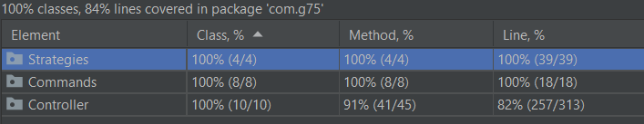

# LPOO_T7G5 - Text-based character ZELDA game

Our project consists of an adventure game similar to the first game of Zelda. The main goal of the game is (obviously) reaching the end of the map.
To get there you will need to defeat several (Very!) dangerous monsters and other obstacles.

This project was developed by Diogo Guimarães do Rosário (Up201806582) and Henrique Melo Ribeiro (Up201806529) for LPOO 2019-20.

# Demonstration GIF

# Implemented Features
1) Walking - The player is able to walk using the arrow keys.
2) Sprite Drawing and Clearing - The game will automatically draw the sprites and clear them during the game's updates (60 FPS).
3) Read info from text files - The game will read all of its sprites and other necessary resources from pre-existant text files.
4) Link has 3 health points and gets some invulnerability time after being hit by an enemy;
5) Collisions - The game tests rectangular collisions between all moving objects and other moving objexts, as well as static objects. 
6) Attacking - The player can attack using the 'x' key.
7) Different enemies movement and attack patterns - The enemies next movement is inside the strategy package. Each enemy has its own strategy.
8) Multiple Levels. The player can switch to the "next" level by standing fully on top of a carpet and clicking the 'z' key.
8) Puzzles. During some levels the player will have to solve puzzles by moving the movable stones.
9) Interaction with the environment. The player can interact with the environment by moving other stones and clicking z to change level while on some elements.
11) Render text. The game will render some text when the player tries to unlock a locked carpet (blue color), letting him know that he needs a key.
12) Boss Battles. There is a boss battle at the end of each map.

# Design Patterns

## MVC
#### Problem in context
Initially, we had a GUI class that was responsible for drawing every element on the screen.

[GUI Class draw and clear](https://github.com/FEUP-LPOO/lpoo-2020-g75/blob/7c2611ab10c815b42fc3713a33480114aa68f651/src/main/java/GUI/GUI.java#L81-L89)

Whenever a new Model (or Element on commit 7c2611) was added, we would have to add the model and the view to this java class and make them draw themselves which would not be the best way to do it. We also had an ElementDrawer class before which would draw any element, so we would have to save the Sprite information on the Model which was also not a good thing to do. 

[Draw Element](https://github.com/FEUP-LPOO/lpoo-2020-g75/blob/8d53d988297a005d5bc83162a553c01f699dff85/src/main/java/GUI/ElementDrawer.java#L8-L21)

[Element abstract Class](https://github.com/FEUP-LPOO/lpoo-2020-g75/blob/8d53d988297a005d5bc83162a553c01f699dff85/src/main/java/Elements/Element.java#L2-L8)
#### The Pattern
We decided to use this pattern in order to better separate the responsabilities of each class. The model doesn't need to know how it draws itself and doesn't need to know how to update itself. So we delegate those responsabilities to the View and Controller respectively.
#### Implementation

#### Consequences
The MVC allows us to easily modify attributes of a Model and how they interact on the controller, to have multiple Views of the same Model. On the other hand, it makes it abit harder to navigate through the code since it adds new layers of abstraction.

## Command Pattern
#### Problem in context
The main motivation for the usage of this pattern was to be able to have a solid design on input commands, so that we were able to add and remove commands later on without needing to change much code. The commands just know how to execute them so while we loop the game every 1/60th of a second we poll for a keyInput that function just returns a command, which we can then execute.

[Command Interface](https://github.com/FEUP-LPOO/lpoo-2020-g75/blob/996a1ccc3d93b8f17b563e0fc14c70efa89fa1b2/src/main/java/Commands/Command.java#L4-L6)

[getNextCommand() in GUI](https://github.com/FEUP-LPOO/lpoo-2020-g75/blob/e945cf91376dbe521730960b4d039c74766fb5c8/src/main/java/GUI/GUI.java#L57-L66)

Later on, this last code snippet was moved to the Game class, which is responsible for looping the game and getting the inputs.

[getNextCommand() in Game](https://github.com/FEUP-LPOO/lpoo-2020-g75/blob/90b8a5a31f8ff5eb7ed899d8df1dc7fd22331a6c/src/main/java/Game.java#L48-L60)
#### The Pattern
This pattern is a good fit because it allows us to give the user several input options to do different actions. To add a new action we just need to add a new command, and add it to getNextCommand().
#### Implementation

#### Consequences
The command pattern respects all of the SOLID principles which makes it a very viable option on its own. Furthermore it gives us the ability to "rollback" the game if we ever need to since you can always implement an undo method. It also allows us to make Commands that consist of other commands (a Composite command) which is easily executable and will not break any existing code.

## Strategy Pattern
#### Problem in context
When creating the various enemies we thought it would be a good idea if there were different types of them, and so we needed to figure out a way to differentiate their movement pattern and so we decided to use the strategy design pattern for this.

[Strategy Example (OrcEnemy)](https://github.com/FEUP-LPOO/lpoo-2020-g75/blob/a588e210eb802074f029ec8dd0e6e7a1f84bfd3f/src/main/java/Strategies/OrcEnemyStrategy.java#L7-L23)

#### The Pattern
Each strategy contains a function getNextMove() which return the next position the enemy will occupy that is later tested in another function. This helps create an environment where the controller doesn't need to know how to move the enemy, just needs to verify if the desired position is available.
#### Implementation

#### Consequences
The implementation of this pattern is very simple and it allows to create various types of movements. 

## State Pattern
#### Problem in context
We initially started by calling the desired functions directly from the Game class constructor:

[Previous Game Loop](https://github.com/FEUP-LPOO/lpoo-2020-g75/blob/077af3fcdae45f85df5b3996bdf34fc9323a841b/src/main/java/Game.java#L18-L26)

After some more developing to the program we decided to opt for a state pattern with the addition of an enum to simplify the addition of future new menus: 

[Enum](https://github.com/FEUP-LPOO/lpoo-2020-g75/blob/5519301daa74aec9edc5fbf6547108084635ccb2/src/main/java/Game.java#L11)

[Current Game Loop](https://github.com/FEUP-LPOO/lpoo-2020-g75/blob/5519301daa74aec9edc5fbf6547108084635ccb2/src/main/java/Game.java#L19-L46)

#### The Pattern
This design pattern helps simplify the creation of new menus since the function run() handles all the correct menus and not the game constructor.
#### Implementation

#### Consequences
Easier creation of new game states such as pause menu, main menu, game state.

# Code Smells and Refactorings
1) [Long Method](https://github.com/FEUP-LPOO/lpoo-2020-g75/blob/4d905ded124f2301d9390291d97e293192247a2e/src/main/java/com/g75/Controller/LinkController.java#L33-L111)

    LinkController needs to know the state of the whole level and test collisions with all other objects while updating. Due to this, this method is very long and representes a code smell. In order to fix this, we removed some of the for's and changed them to other functions that do the same thing.
    In order to fix this, we changed some loops to auxiliary functions that do the same thing, improving our code by using the Extract Method Refactoring.
    
2) [Large Class](https://github.com/FEUP-LPOO/lpoo-2020-g75/blob/develop/src/main/java/com/g75/Model/LinkModel.java#L7-L127)

    Our main character (Link) has a lot of attributes and so represents a large class. To fix this we could move some of his atributes to another class but we would run into the Data Clump code smell.

3) [Long Parameter List](https://github.com/FEUP-LPOO/lpoo-2020-g75/blob/develop/src/main/java/com/g75/Controller/LinkController.java#L155-L172)

    To move the main character we need to test collisions with all other objects on the map. As so, we need their sprites, positions, sprite of our main character and position.
    As a consequence, we run into this code smell. To fix this, we could group this data in a class, but we would run into the Data Clump code smell again.

4) [Temporary Field](https://github.com/FEUP-LPOO/lpoo-2020-g75/blob/develop/src/main/java/com/g75/Model/LevelModel.java#L27)

    The boss model is used in level model as null even if it doesn't exist on that level and so becomes a temporary field, which is only "active" when we reach a boss level/fight.
    To fix this, we could make the boss have a "reference" to the level it belongs to, and move it outside the LevelModel class to the MapModel class.

5) [Refused Bequest (Before)](https://github.com/FEUP-LPOO/lpoo-2020-g75/blob/ba3c0f2ea30eaf473bcc18fc777992523c0b9271/src/main/java/com/g75/Controller/WizardBossController.java#L14-L20)

   [Refused Bequest(After)](https://github.com/FEUP-LPOO/lpoo-2020-g75/blob/develop/src/main/java/com/g75/Controller/BossEnemyController.java#L7-L10)
   
   We fixed this code smell by changing up the interface which didn't need to have all the methods we implemented at first.
   So, we used the Extract Superclass Refactoring.

6) [Duplicate Code (Function 1)](https://github.com/FEUP-LPOO/lpoo-2020-g75/blob/1976f485a8b9d88d6bcf227ab8ae0749d69657cd/src/main/java/com/g75/Controller/LinkController.java#L150-L153)
    
   [Duplicate Code(Function 2)](https://github.com/FEUP-LPOO/lpoo-2020-g75/blob/1976f485a8b9d88d6bcf227ab8ae0749d69657cd/src/main/java/com/g75/Controller/LinkController.java#L132-L134)
   
   These 2 methods do the same thing, with the exception of a parameter.

7) [Dead Code(Fixed)](https://github.com/FEUP-LPOO/lpoo-2020-g75/blob/1976f485a8b9d88d6bcf227ab8ae0749d69657cd/src/main/java/com/g75/Model/CarpetModel.java#L9-L14)

    We used to have some dead code (especially default constructors) which were never used, but it is now removed.
    The example we decided to show was an if condition that was never actually reached.
    The refactoring technique we decided to use was to remove all unused code.
    
# Tests
We did not test models (Almost all models only have getters or setters and do not know how to "operate" over themselves, so we did not test them)
The same thing happened to the views. Since we use sprites it is very hard and not practical to test these views.
The game loop was also not tested because it did not make much sense.
As such, our coverage and mutation percentages were reduced.

Test coverage with models and views: 

Mutation tests with models and views:

Test coverage without models and views: 

Mutation tests without models and views:

# Contribution:

No member felt like they were working more than the other.
And so the contribution is 50% for both.